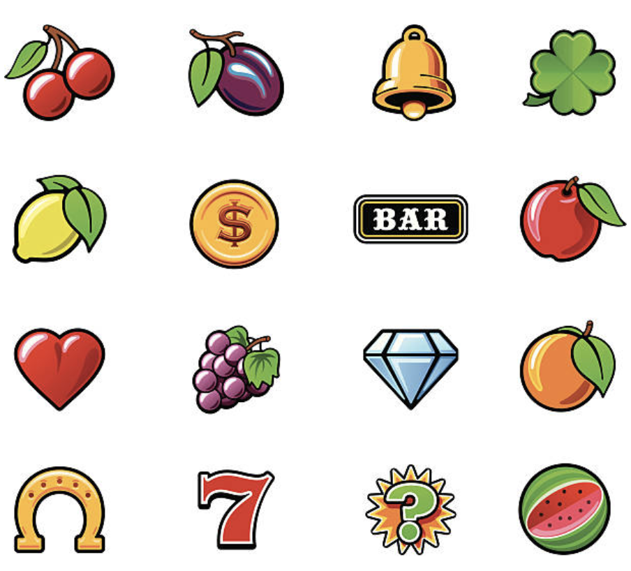

# Group B - Themes

Group B — Casino UI/UX + Visual Themes Research what makes casino games look and feel good. Cover visual design, color schemes, animations, sound design, and anything that makes a slot game feel immersive. Drop a summary doc in raw-research/.

By: Hien, Ava

## Visual Effects

- For regular wins, the machine will display blasting confetti and fireworks while highlighting the winning reels with a red border.
- For jackpot wins, the screen will flash with lightning, followed by a specific theme animation
- This could be a gold coin rain for Miner's Jackpot, a yellow dragon appearing for Dragon's Fortune, or something mysterious for Forbidden Party.
  The screen may also shake slightly before the theme animation appears to build anticipation.
  Additional features include a bet multiplier, adjustable bet amounts, and a hold spin button.

## Sound Effects

- Each reel should have its own distinct click sound when it stops.
- Wins will play a celebratory melody that scales with the size of the win
  - Bigger wins will have longer celebrations with a higher pitch.
- Losses will have a slight descending tone that is noticeable but not annoying.
- Jackpots will have a unique sound effect designed to make the win feel exciting and rewarding.
- Background music will be included to set the mood based on the selected theme.
- Additional audio feedback will cover button clicks, bet changes, bet multiplier adjustments, and lever pulls.

## Color Schemes

- Each theme has a unique color palette to reinforce its identity
  - Forbidden Party uses a dark, black-heavy palette with mysterious theme.
  - Dragon's Fortune uses rich reds and golds for a classic, powerful aesthetic.
  - Miner's Jackpot uses warm amber and earthy brown tones to produce a gold rush atmosphere.

## UI/UX Layout

- The interface will feature a two-screen layout
  - The top screen serves as the jackpot display, where the jackpot values slowly increase in real time (each spin)
    - This display could include levels such as a grand jackpot, major jackpot, minor bonus, and mini bonus.
  - The bottom screen contains the main game area: the spinning reels, the player's current credit balance, the bet amount, and the win amount.
  - This screen will also include buttons to change sound effects on or off, viewing the game rules and paytable (which clearly shows every winning combination and its multiplier), accessing the game menu, and viewing the spin history or recent transaction log so players can review their last several results.
  - An autoplay spin option will also be available for players who prefer faster gameplay.

# Animations

- Reel deceleration is a key part of making each spin feel significant.
- Each reel should stop one at a time with a slight delay between them to build anticipation.
- During fast spinning, the symbols should appear blurred and then gradually sharpen as the reel slows down.
- When a reel lands, it could overshoot slightly and bounce back into place.

# Standard Reel Symbols

